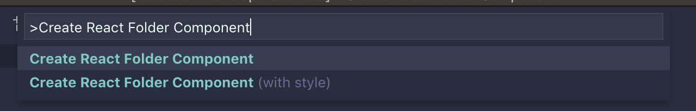
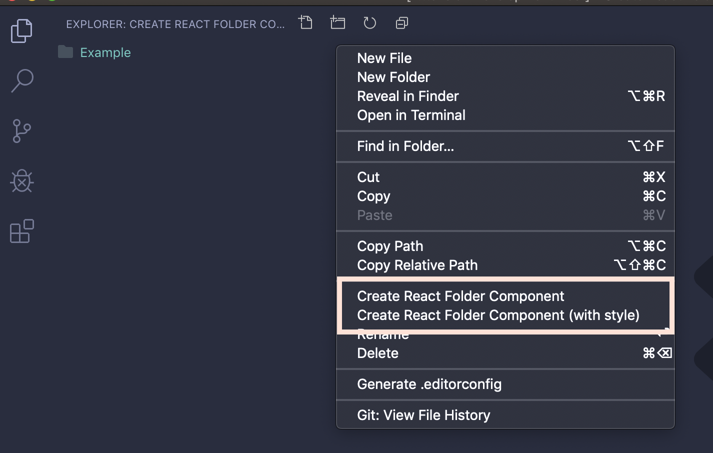
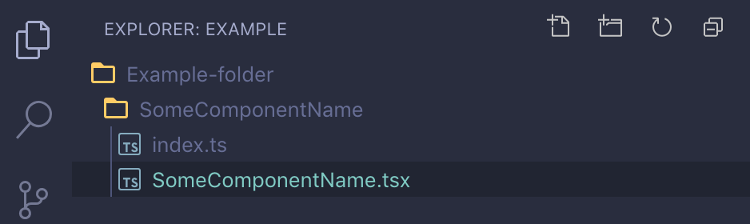
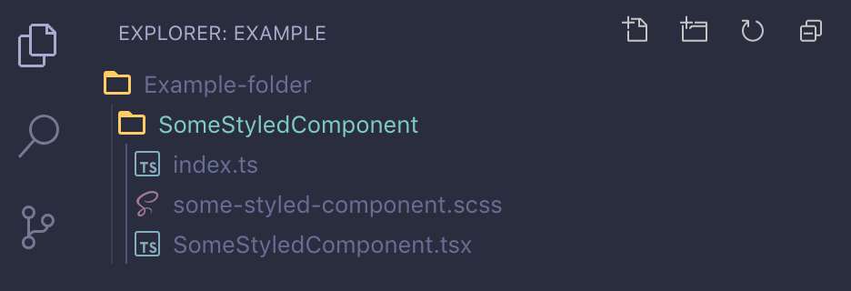
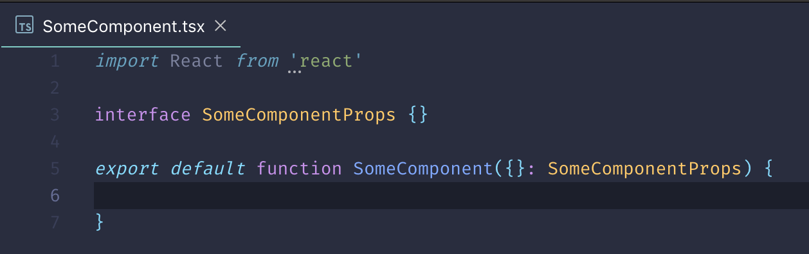
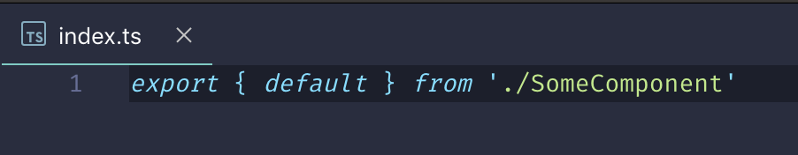

# Create React Folder Component

A simple wizard that speeds up creating new React folder components.

It supports both JavaScript and TypeScript.

The templates used when creating the component files are completely configurable through settings.

## Features

This extension provides two commands, accessible in the explorer context menu and in the command palette.

Command palette:


Explorer context menu:


When activated it will prompt you to give your component a name:


The extension will then create a folder and files for a new component with your given name:


With styles:


The default contents of those files will be (without style):



## Requirements

No extra requirements 🎉.

## Extension Settings

### Template Language

By default the extension will ask you each time which language you want to use for your component but you can change that behaviour with this setting.

Available options:
- `JavaScript`
- `TypeScript`
- `Ask`

Default: `Ask`

### Template content settings

All the following settings control the contents of the templates that will be used when creating your components.

The following variables are exposed in your templates.

| Variable | Description |
|----------|-------------|
| $COMPONENT_NAME | The name you entered for the component. |
| $STYLE_COMPONENT_NAME | A transformed css-style name of the component name. |
| $STYLE_COMPONENT_FILENAME | The filename of the style file. It's a result of the `styleFileNameTemplate` setting of the current language. |

#### JavaScript Component file Template

Template for your component file in JavaScript.

Default:
```json
[
  "import React from 'react'",
  "import PropTypes from 'prop-types'",
  "",
  "$COMPONENT_NAME.propTypes = {",
  "}",
  "",
  "export default function $COMPONENT_NAME({}) {",
  "}"
]
```

#### JavaScript styled Component file Template

Template used for creating the styled Component file in JavaScript.

Default:
```json
[
  "import React from 'react'",
  "import PropTypes from 'prop-types'",
  "import './$STYLE_COMPONENT_FILENAME'",
  "",
  "$COMPONENT_NAME.propTypes = {",
  "}",
  "",
  "export default function $COMPONENT_NAME({}) {",
  "}"
]
```

#### JavaScript index file Template

Template used for creating the index file in JavaScript.

Default:
```json
[
  "export { default } from './$COMPONENT_NAME'"
]
```

#### JavaScript style file Template

Template used for creating the style file in JavaScript.

Default:
```json
[
  ".$STYLE_COMPONENT_NAME {}"
]
```

#### JavaScript style file name template

File name for style file in JavaScript.

Default: `"$STYLE_COMPONENT_NAME.scss"`

#### TypeScript Component file Template

Template used for creating the Component file in TypeScript.

Default:
```json
[
  "import React from 'react'",
  "",
  "interface $COMPONENT_NAMEProps {",
  "}",
  "",
  "export default function $COMPONENT_NAME({}: $COMPONENT_NAMEProps) {",
  "}"
]
```

#### TypeScript styled Component file Template

Template used for creating the styled Component file in TypeScript.

Default:
```json
[
  "import React from 'react'",
  "import './$STYLE_COMPONENT_FILENAME'",
  "",
  "interface $COMPONENT_NAMEProps {",
  "}",
  "",
  "export default function $COMPONENT_NAME({}: $COMPONENT_NAMEProps) {",
  "}"
]
```
#### TypeScript index file Template

Template used for creating the index file in TypeScript.

Default:
```json
[
  "export { default } from './$COMPONENT_NAME'"
]
```

#### TypeScript style file Template

Template used for creating the style file in TypeScript.

Default:
```json
[
  ".$STYLE_COMPONENT_NAME {}"
]
```

#### TypeScript style file name template

File name for style file in TypeScript.

Default: `"$STYLE_COMPONENT_NAME.scss"`

## Known Issues

There's no known issues 🐞.

If you find something, please report it at https://github.com/HektorW/vs-code-create-react-folder-component.

## Release Notes

See CHANGELOG.md
